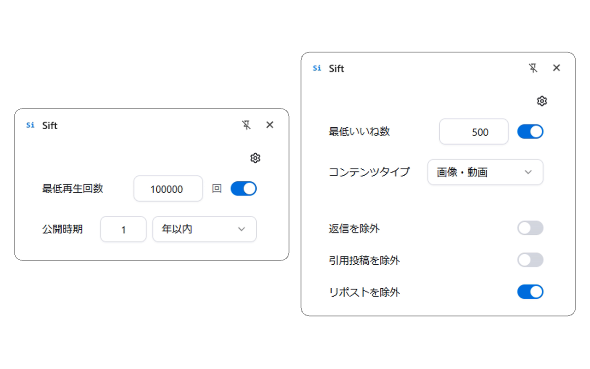

# Sift

SNSや動画サイトの投稿を反応数などで絞り込むChrome拡張機能です。

## 対応サイト

- X
- Bluesky
- YouTube
- ニコニコ動画

## 対象項目

- いいね数・再生数
- 投稿日時
- 画像・動画のみ
- 返信・引用・リポストの除外

## インストール

[Chrome ウェブストア](https://chromewebstore.google.com/detail/sift/jglehalaegleehefcefnfmmbblgkomeh)

## 開発を始める

[開発ガイド.md](docs/開発ガイド.md) を参照してください。

## セキュリティ

脆弱性は[非公開の報告フォーム](https://github.com/apricot-cake/sift/security/advisories/new)から報告してください。

## プライバシー

データの扱いは [プライバシーポリシー](PRIVACY.md) を参照してください。

## ライセンス

[MIT License](LICENSE)
